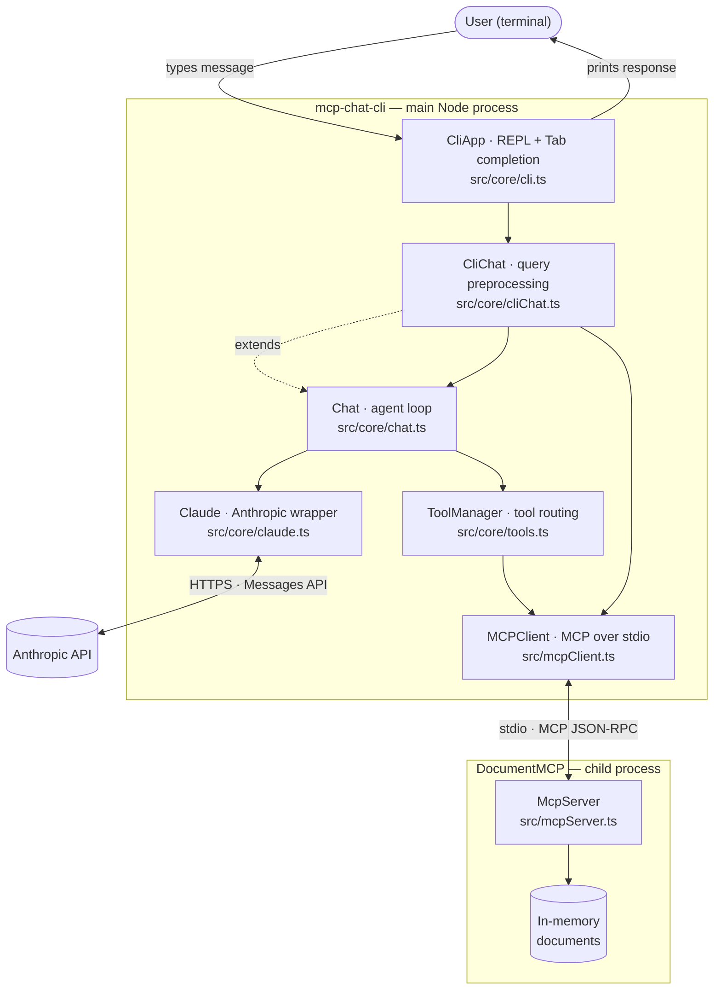
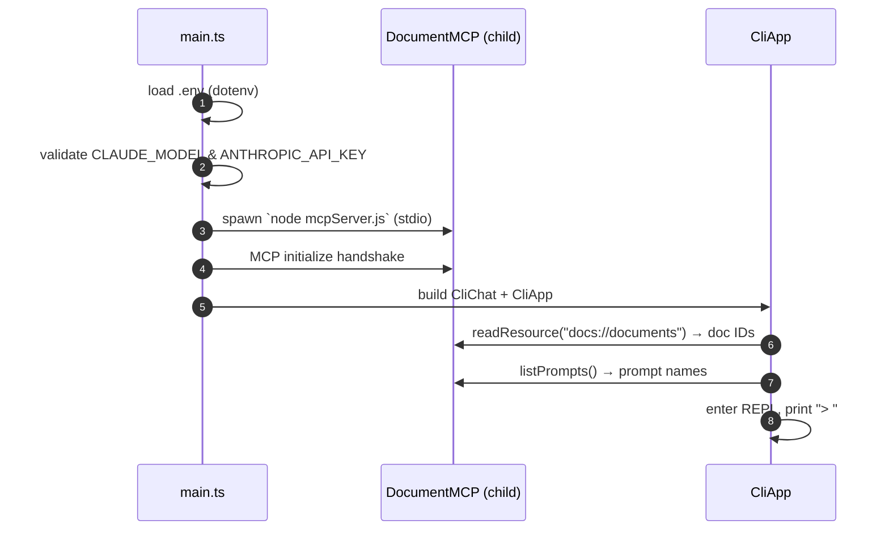
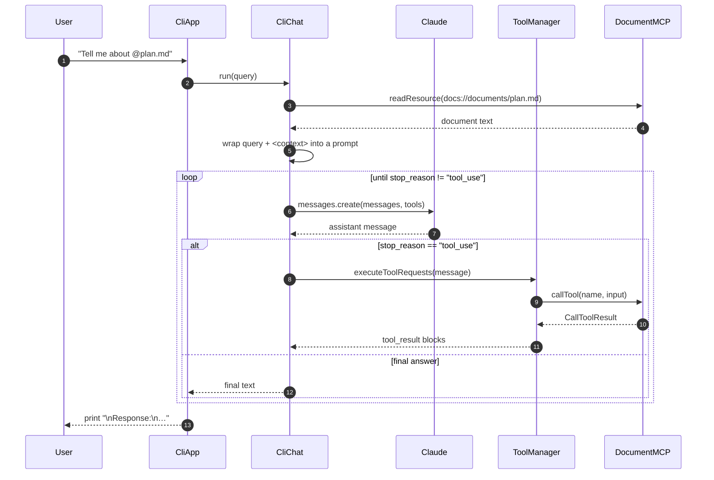
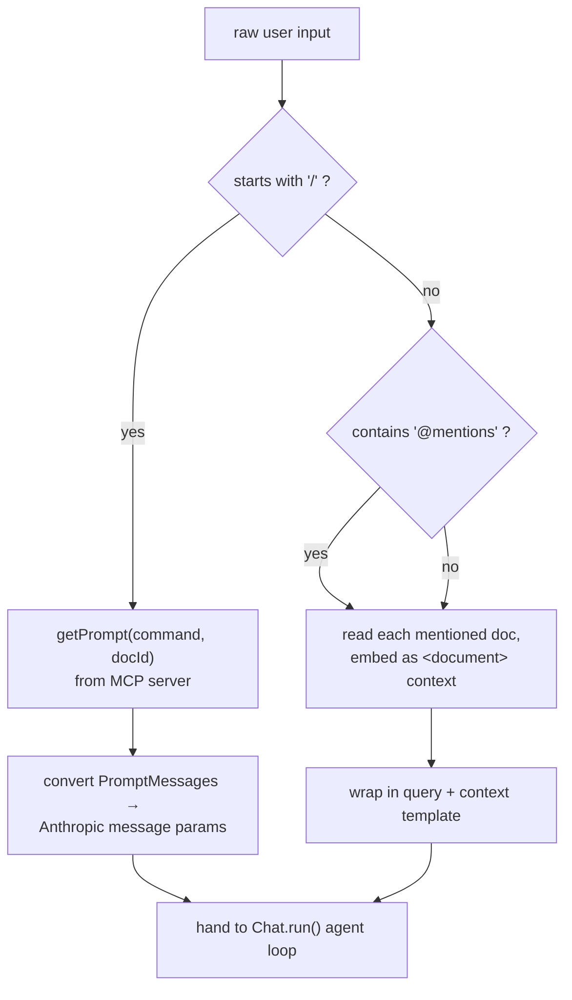

# MCP Chat CLI

A command‑line application for interactive chat with **Claude** (the Anthropic
API), extended with the **Model Context Protocol (MCP)**. It lets you pull
document content into your questions with `@mentions`, run server‑defined prompt
templates with `/commands`, and gives the model **tools** it can call to read and
edit documents — all from your terminal.

The project is written in **TypeScript** and runs on **Node.js**. It ships with a
bundled MCP server ("DocumentMCP") that exposes a small in‑memory document store,
and it can connect to additional MCP servers you provide.

---

## Table of contents

1. [Project overview](#1-project-overview)
2. [Architecture](#2-architecture)
3. [Folder structure](#3-folder-structure)
4. [Installation](#4-installation)
5. [Environment setup](#5-environment-setup)
6. [Configuration](#6-configuration)
7. [Running the project](#7-running-the-project)
8. [How the workflow functions](#8-how-the-workflow-functions)
9. [Usage examples](#9-usage-examples)
10. [Debugging & troubleshooting](#10-debugging--troubleshooting)
11. [Important design decisions](#11-important-design-decisions)
12. [Dependencies](#12-dependencies)
13. [Technical deep‑dive (module reference)](#13-technical-deep-dive-module-reference)
14. [Testing & quality gates](#14-testing--quality-gates)
15. [Extending the project](#15-extending-the-project)
16. [FAQ for new developers](#16-faq-for-new-developers)

---

## 1. Project overview

### What it does

`mcp-chat-cli` is a REPL (read‑eval‑print loop). You type a message, press Enter,
and the application:

- enriches your message with any referenced documents,
- sends it to Claude,
- lets Claude call **tools** (e.g. read or edit a document) as many times as it
  needs, and
- prints the model's final answer.

It demonstrates a clean, minimal **agentic loop** built on two official SDKs:

- **`@anthropic-ai/sdk`** — talks to the Claude Messages API.
- **`@modelcontextprotocol/sdk`** — the client/server implementation of MCP, the
  open protocol for exposing tools, resources, and prompts to language models.

### Core concepts

| Concept      | In this app                                                                       | MCP term |
| ------------ | --------------------------------------------------------------------------------- | -------- |
| **Tool**     | `read_doc_contents`, `edit_document` — functions the model can invoke             | Tool     |
| **Resource** | the document store, addressable as `docs://documents` and `docs://documents/{id}` | Resource |
| **Prompt**   | `format` — a reusable prompt template the user triggers with `/format <doc>`      | Prompt   |

### Two ways the model gets information

1. **`@mention` (resource injection):** typing `@plan.md` makes the app fetch that
   document's text and embed it directly in the prompt as context — no tool call
   needed.
2. **Tools (model‑driven):** the model can decide on its own to call
   `read_doc_contents` or `edit_document` mid‑conversation; the app executes the
   call against the MCP server and feeds the result back.

### Requirements at a glance

- Node.js **20 or newer**
- An **Anthropic API key**
- Internet access (to reach the Anthropic API)

---

## 2. Architecture

### High‑level component view

The application is a single Node process that launches the MCP server as a **child
process** and communicates with it over **stdio**. It talks to the Anthropic API
over HTTPS.



### Startup sequence



### A single chat turn (the agent loop)



### Query preprocessing logic

Before anything reaches the model, `CliChat.processQuery` decides how to handle the
raw input:



---

## 3. Folder structure

```text
mcp-chat-cli/
├── src/
│   ├── main.ts            # Entry point: env validation, server spawn, wiring, REPL start
│   ├── mcpClient.ts       # MCPClient — wraps an MCP client session over stdio
│   ├── mcpServer.ts       # DocumentMCP — the bundled MCP server (in-memory documents)
│   └── core/
│       ├── claude.ts      # Claude — thin wrapper over the Anthropic Messages API
│       ├── chat.ts        # Chat — the model/tool agent loop
│       ├── cliChat.ts     # CliChat — @document / /command preprocessing + conversion
│       ├── cli.ts         # CliApp — the readline REPL with Tab completion
│       └── tools.ts       # ToolManager — aggregates and executes MCP tools
├── tests/
│   ├── tools.test.ts      # Unit tests: tool-result building
│   ├── cliChat.test.ts    # Unit tests: prompt-message conversion + resolveId
│   └── completer.test.ts  # Unit tests: Tab-completion logic
├── dist/                  # Compiled JavaScript (generated by `npm run build`; git-ignored)
├── .env                   # Your local secrets/config (git-ignored)
├── .env.example           # Template for .env
├── package.json           # Scripts, dependencies, metadata
├── package-lock.json      # Exact dependency lockfile
├── tsconfig.json          # TypeScript compiler configuration (strict, ESM/NodeNext)
├── eslint.config.js       # ESLint flat config (typescript-eslint)
├── .prettierrc.json       # Prettier formatting rules
├── .prettierignore        # Paths Prettier skips
├── vitest.config.ts       # Vitest test configuration
├── knip.json              # Dead-code / unused-export analysis config
└── README.md              # This file
```

**One file = one responsibility.** Each module is small and independently
understandable; the file names map 1:1 to the components in the architecture
diagrams above.

---

## 4. Installation

### Prerequisites

- **Node.js ≥ 20** — check with `node --version`. Install from
  [nodejs.org](https://nodejs.org/) or via a version manager (`nvm`, `fnm`, …).
- **npm** (ships with Node).
- An **Anthropic API key** — create one at
  [console.anthropic.com](https://console.anthropic.com/).

### Steps

```bash
# 1. Clone the repository
git clone https://github.com/smakubi/mcp-chat-cli.git
cd mcp-chat-cli

# 2. Install dependencies
npm install

# 3. Create your environment file
cp .env.example .env
#    then edit .env and paste your real ANTHROPIC_API_KEY

# 4. Run it
npm run dev
```

That's the whole setup. `npm install` pulls the four runtime dependencies and the
dev tooling; nothing else is required.

---

## 5. Environment setup

Configuration is read from a `.env` file in the project root at startup (via
`dotenv`). Copy the template and fill it in:

```bash
cp .env.example .env
```

`.env`:

```ini
# The Claude model to use (e.g. claude-sonnet-4-5, claude-opus-4-8)
CLAUDE_MODEL="claude-sonnet-4-5"

# Your Anthropic API secret key
ANTHROPIC_API_KEY="sk-ant-..."
```

> **Security:** `.env` is listed in `.gitignore` and must never be committed. Only
> `.env.example` (with no secrets) is tracked. The Anthropic SDK reads
> `ANTHROPIC_API_KEY` from the environment automatically.

**Precedence:** real shell environment variables win over values in `.env` (this
matches `dotenv`'s default — it never overrides already‑set variables). That means
you can override per‑run, e.g. `CLAUDE_MODEL=claude-opus-4-8 npm run dev`.

---

## 6. Configuration

### Environment variables

| Variable            | Required | Default | Description                                                                     |
| ------------------- | -------- | ------- | ------------------------------------------------------------------------------- |
| `CLAUDE_MODEL`      | ✅       | —       | The Claude model ID the app sends requests to. Startup fails fast if empty.     |
| `ANTHROPIC_API_KEY` | ✅       | —       | Your Anthropic API key. Startup fails fast if empty. Used by the Anthropic SDK. |

Both are validated at launch; a missing value prints a clear error and exits with
code `1` (no stack trace), e.g.:

```
Error: ANTHROPIC_API_KEY cannot be empty. Update .env
```

### Anthropic request shape

The model request is fixed in `src/core/claude.ts`:

- `max_tokens: 8000`
- `temperature: 1.0`
- `stop_sequences: []`
- `tools`, `system`, and `thinking` are added only when provided.

These mirror the original reference implementation; change them in `claude.ts` if
you need different behavior.

### Tooling configuration files

| File                                   | Controls                                                                                                   |
| -------------------------------------- | ---------------------------------------------------------------------------------------------------------- |
| `tsconfig.json`                        | TypeScript: `strict`, `ES2022`, ESM (`NodeNext`), `rootDir: src`, `outDir: dist`, no unused locals/params. |
| `eslint.config.js`                     | Lint rules (flat config + `typescript-eslint`).                                                            |
| `.prettierrc.json` / `.prettierignore` | Code formatting.                                                                                           |
| `vitest.config.ts`                     | Test discovery (scoped to `tests/`).                                                                       |
| `knip.json`                            | Unused files / exports detection.                                                                          |

---

## 7. Running the project

| Command                  | What it does                                                                         |
| ------------------------ | ------------------------------------------------------------------------------------ |
| `npm run dev`            | Run directly from TypeScript source via `tsx` (no build step). Best for development. |
| `npm run inspect`        | Open the **MCP Inspector** UI against the bundled DocumentMCP server (see below).    |
| `npm run build`          | Compile TypeScript to `dist/`.                                                       |
| `npm start`              | Run the compiled app (`node dist/main.js`). Requires a prior `npm run build`.        |
| `npm test`               | Run the Vitest unit tests.                                                           |
| `npm run typecheck`      | Type‑check without emitting (`tsc --noEmit`).                                        |
| `npm run lint`           | Lint the codebase with ESLint.                                                       |
| `npm run format`         | Auto‑format with Prettier.                                                           |
| `npm run format:check`   | Verify formatting without writing.                                                   |
| `npm run check:circular` | Detect circular dependencies (`madge`).                                              |

### Development run

```bash
npm run dev
```

### Production‑style run

```bash
npm run build
npm start
```

### Connecting additional MCP servers

Any extra command‑line arguments are treated as paths to additional MCP server
scripts. Each is launched as its own stdio subprocess (with `node`), and its tools
become available to the chat alongside DocumentMCP's:

```bash
npm start -- ./path/to/another-server.js
# or in dev:
npm run dev -- ./path/to/another-server.js
```

### Inspecting the MCP server

```bash
npm run inspect
```

This launches the [MCP Inspector](https://github.com/modelcontextprotocol/inspector),
which starts the bundled DocumentMCP server (`mcp-inspector tsx src/mcpServer.ts`)
and opens a web UI (default `http://localhost:6274`, proxy on `6277`). Use it to
browse and exercise the server's **tools**, **resources**, and **prompts**
interactively — independent of the chat app. The console prints a session token
and pre‑authenticated URL; open that URL if the browser doesn't launch
automatically.

---

## 8. How the workflow functions

This section walks through exactly what happens, end to end.

### 8.1 Startup (`src/main.ts`)

1. `import "dotenv/config"` loads `.env` into `process.env`.
2. `requireEnv("CLAUDE_MODEL")` and `requireEnv("ANTHROPIC_API_KEY")` validate the
   two required variables; if either is empty, the app prints an error and exits.
3. A `Claude` service is created (the Anthropic SDK reads the API key from the
   environment).
4. The bundled MCP server path is resolved **relative to the running entry file**
   (`dist/mcpServer.js` in a built run, `src/mcpServer.ts` under `tsx`), and an
   `MCPClient` launches it as a child process using the current Node binary
   (`process.execPath`). This client is registered as `doc_client`.
5. Any extra server scripts passed on the command line are launched the same way.
6. A `CliChat` is built (it gets the `doc_client`, the full client map, and the
   `Claude` service), wrapped in a `CliApp`, then `initialize()` + `run()` start
   the REPL.
7. On exit (or error), a `finally` block calls `cleanup()` on every client,
   tearing down the child processes.

### 8.2 Initialization (`CliApp.initialize`)

- `refreshResources()` reads `docs://documents` from the server to get the list of
  document IDs (used for `@` completion).
- `refreshPrompts()` calls `listPrompts()` to get the available `/commands` (used
  for `/` completion).
- Both are wrapped in try/catch and log a warning rather than crashing if the
  server is unreachable.

### 8.3 The REPL loop (`CliApp.run`)

- A Node `readline` interface is created with a **completer** function.
- The loop prompts with `> `, reads a line, and:
  - skips blank input,
  - passes anything else to `agent.run(input)` and prints the result.
- **Tab completion** (`buildCompletions`) handles three cases: `@prefix` →
  document IDs; `/prefix` → command names; `/command <argPrefix>` → document IDs.
  Tab completion requires a real TTY that delivers keystrokes in raw mode; some
  embedded/web terminals don't, in which case Tab does nothing — but you don't
  need it (see prefix resolution below).
- **Ctrl‑D (EOF)** and **Ctrl‑C** both exit the loop cleanly — the prompt is raced
  against readline's `close` event so the app never hangs on stream close.

### 8.4 Query preprocessing (`CliChat.processQuery`)

- If the input starts with `/`, it is treated as a **command**: the app fetches the
  matching MCP prompt (`getPrompt(command, { doc_id })`), converts the returned
  messages to Anthropic format, and appends them to the conversation.
- Otherwise, the app scans for `@mentions`, reads the content of each mentioned
  document, and embeds it inside a structured prompt template under a `<context>`
  block, instructing the model to answer from that context without referring to it.
- **Prefix resolution** (`resolveId`): both `@mentions` and `/command` arguments
  (and command names) are resolved to a known id by an exact match first, then by a
  single unambiguous case‑insensitive prefix. So `@pl` resolves to `plan.md` and
  `/for sp` behaves like `/format spec.txt` — even when Tab completion isn't
  available. Ambiguous or unknown tokens are left untouched.

### 8.5 The agent loop (`Chat.run`)

```text
append preprocessed message
loop:
    tools     = aggregate tools from all MCP clients
    response  = Claude.chat(messages, tools)
    append assistant message
    if response.stop_reason == "tool_use":
        print any assistant text
        results = ToolManager.executeToolRequests(response)
        append results as a user message
        continue
    else:
        return final text
```

`ToolManager.executeToolRequests` finds which client owns each requested tool,
calls it, serializes the text content to JSON, and returns `tool_result` blocks
(marking `is_error` appropriately). If a tool throws, a clean error result is
returned so the loop can continue.

### 8.6 The MCP server (`src/mcpServer.ts`)

DocumentMCP holds documents in an in‑memory object and exposes:

- **Tools:** `read_doc_contents(doc_id)` and
  `edit_document(doc_id, old_str, new_str)`.
- **Resources:** `docs://documents` (JSON array of IDs) and
  `docs://documents/{doc_id}` (plain text content).
- **Prompt:** `format(doc_id)` — returns a user message instructing the model to
  rewrite a document in Markdown using the `edit_document` tool.

It speaks MCP over stdio and is fully self‑contained.

---

## 9. Usage examples

Start the app (`npm run dev`), then:

### Plain chat

```text
> What is the Model Context Protocol in one sentence?
```

### Document retrieval with `@`

Pull a document's content into your question. Press **Tab** after `@` to
autocomplete IDs — or just type a unique prefix and press **Enter**: `@pl`
resolves to `plan.md` (see [prefix resolution](#84-query-preprocessing-clichatprocessquery)).

```text
> Summarize @report.pdf and @plan.md together
> Summarize @pl          # same thing — prefix resolves to plan.md
```

### Running a server prompt with `/`

Press **Tab** to complete the command name and the document argument — or type
unique prefixes and press **Enter**: `/for sp` runs the `format` prompt on
`spec.txt`.

```text
> /format spec.txt
> /for sp                # same thing — prefixes resolve to format + spec.txt
```

This triggers the `format` prompt, which asks the model to rewrite `spec.txt` in
Markdown using the `edit_document` tool — exercising the full tool loop.

### Letting the model use tools on its own

Even without `@`, the model can choose to call tools:

```text
> Change the word "budget" to "forecast" in financials.docx, then show me the result
```

The model will call `edit_document` and then `read_doc_contents` (or use the
returned content) before answering.

### Exiting

Press **Ctrl‑D** (or **Ctrl‑C**) at the prompt.

---

## 10. Debugging & troubleshooting

| Symptom                                                  | Cause                                                                                  | Fix                                                                                                          |
| -------------------------------------------------------- | -------------------------------------------------------------------------------------- | ------------------------------------------------------------------------------------------------------------ |
| `Error: ANTHROPIC_API_KEY cannot be empty. Update .env`  | No API key set                                                                         | Add your key to `.env` (or export it in the shell).                                                          |
| `Error: CLAUDE_MODEL cannot be empty. Update .env`       | No model set                                                                           | Set `CLAUDE_MODEL` in `.env`.                                                                                |
| `AuthenticationError: 401 … invalid x-api-key`           | Wrong/placeholder API key                                                              | Use a valid key from the Anthropic console.                                                                  |
| `Cannot find package '…' imported from …`                | Dependencies not installed                                                             | Run `npm install`.                                                                                           |
| `Error refreshing resources/prompts:` printed at startup | The MCP server failed to start or respond                                              | Ensure you ran `npm run build` before `npm start`; check Node ≥ 20.                                          |
| The app exits after an API error mid‑chat                | A live API error propagates out of the REPL (faithful to the original design)          | Re‑run; fix the underlying cause (key, network, rate limit).                                                 |
| **Tab** does nothing after `@` or `/`                    | Your terminal isn't delivering Tab as a raw keypress (common in embedded/web consoles) | You don't need Tab — type a unique prefix (`@pl`, `/for sp`) and press **Enter**; it resolves automatically. |
| `404 not_found_error` from the API                       | Invalid model ID                                                                       | Use a current model ID (e.g. `claude-sonnet-4-5`, `claude-opus-4-8`).                                        |
| Stray `node_modules <timestamp>` folders appear          | A file‑sync service (e.g. iCloud/Desktop sync) duplicating `node_modules`              | Harmless and git‑ignored (`node_modules*`). For a clean workspace, keep the project outside a synced folder. |

### Useful diagnostics

```bash
# Confirm Node version
node --version            # must be >= 20

# Verify the toolchain end to end (no API key needed)
npm run typecheck && npm run lint && npm test && npm run build

# Verify the MCP layer without calling the model:
#   build first, then connect a client to the bundled server and list its tools.
npm run build
node --input-type=module -e '
  import("./dist/mcpClient.js").then(async ({ MCPClient }) => {
    const c = new MCPClient({ command: process.execPath, args: ["dist/mcpServer.js"] });
    await c.connect();
    console.log("tools:", (await c.listTools()).map(t => t.name));
    console.log("docs:", await c.readResource("docs://documents"));
    await c.cleanup();
  });
'
```

If the diagnostic prints the tool names and document IDs, the MCP client/server
plumbing is healthy and any remaining issue is on the Anthropic API side (key,
model, network).

### Where to add logging

- **MCP traffic / tool routing:** `src/core/tools.ts` (`executeToolRequests`).
- **Conversation contents:** `src/core/chat.ts` (inside the loop) or
  `src/core/claude.ts` (`chat` params/response).
- **Query preprocessing:** `src/core/cliChat.ts` (`processQuery`).

---

## 11. Important design decisions

- **TypeScript over plain JavaScript.** Both core dependencies
  (`@modelcontextprotocol/sdk`, `@anthropic-ai/sdk`) are written in TypeScript and
  ship first‑class types. TypeScript therefore _reduces_ risk here (catching wiring
  mistakes at compile time) rather than adding ceremony.
- **ESM + `NodeNext`.** The MCP SDK is ESM‑only, so the whole project is ESM
  (`"type": "module"`), and all relative imports use explicit `.js` specifiers (the
  TypeScript/Node ESM requirement).
- **`readline` + Tab completion instead of a live menu.** The interactive REPL uses
  Node's built‑in `readline`. Completion is **Tab‑triggered** rather than a live
  pop‑up. This keeps the dependency surface tiny and the runtime predictable, at the
  cost of a slightly less flashy UX. The completion _logic_ is a pure function
  (`buildCompletions`) and is unit‑tested.
- **Robust EOF/Ctrl‑C handling.** `readline`'s `question()` promise does not settle
  when stdin closes, so the loop races it against the `close` event (plus an
  explicit `SIGINT` handler). Result: clean exit on both Ctrl‑D and Ctrl‑C — no
  hang.
- **In‑memory document store.** Documents live in a plain object in `mcpServer.ts`.
  There is no database; this keeps the example self‑contained. Swapping in a real
  store means changing only that file.
- **Bundled server launched as a child process.** The app spawns the MCP server
  with the current Node binary and resolves its path relative to the entry file, so
  the same code works whether you run from `dist/` or via `tsx`.
- **Faithful Anthropic request shape.** `max_tokens`, `temperature`, and the
  optional `thinking` block intentionally match the reference behavior; the model is
  fully env‑configurable.
- **Clean error paths.** Tool execution failures return structured `is_error`
  results instead of crashing the loop; missing env vars fail fast with readable
  messages.
- **Quality gates, not just code.** The project ships strict `tsc`, ESLint,
  Prettier, Vitest, `madge` (circular deps), and `knip` (dead code) so correctness
  is enforced, not assumed.

---

## 12. Dependencies

### Runtime

| Package                     | Why it's here                                                      |
| --------------------------- | ------------------------------------------------------------------ |
| `@anthropic-ai/sdk`         | Official client for the Claude Messages API.                       |
| `@modelcontextprotocol/sdk` | Official MCP implementation (client + server + stdio transports).  |
| `dotenv`                    | Loads `.env` into `process.env` at startup.                        |
| `zod`                       | Declares the input schemas for the MCP server's tools and prompts. |

### Development

| Package                                     | Why it's here                                   |
| ------------------------------------------- | ----------------------------------------------- |
| `typescript`                                | The compiler.                                   |
| `tsx`                                       | Runs TypeScript directly for `npm run dev`.     |
| `@modelcontextprotocol/inspector`           | MCP Inspector UI for `npm run inspect`.         |
| `vitest`                                    | Unit test runner.                               |
| `eslint`, `typescript-eslint`, `@eslint/js` | Linting (flat config).                          |
| `prettier`                                  | Formatting.                                     |
| `@types/node`                               | Node type definitions.                          |
| `madge`                                     | Circular‑dependency detection.                  |
| `knip`                                      | Unused file / export detection (run via `npx`). |

Exact versions are pinned in `package.json` and locked in `package-lock.json`.

---

## 13. Technical deep‑dive (module reference)

### `src/main.ts` — entry point

Loads env, validates configuration, spawns the DocumentMCP child process (and any
extra servers passed as args), wires `Claude` + `CliChat` + `CliApp`, runs the
REPL, and cleans up all clients in a `finally` block.

### `src/mcpClient.ts` — `MCPClient`

A thin wrapper around the MCP SDK `Client` + `StdioClientTransport`. Public API:

| Method                  | Returns                    | Purpose                                                                 |
| ----------------------- | -------------------------- | ----------------------------------------------------------------------- |
| `connect()`             | `Promise<void>`            | Spawn the server process and initialize the session.                    |
| `listTools()`           | `Promise<Tool[]>`          | List the server's tools.                                                |
| `callTool(name, args?)` | `Promise<CallToolResult>`  | Invoke a tool.                                                          |
| `listPrompts()`         | `Promise<Prompt[]>`        | List the server's prompts.                                              |
| `getPrompt(name, args)` | `Promise<PromptMessage[]>` | Fetch a prompt's messages.                                              |
| `readResource(uri)`     | `Promise<unknown>`         | Read a resource (JSON is parsed automatically; text is returned as‑is). |
| `cleanup()`             | `Promise<void>`            | Close the session and tear down the transport.                          |

### `src/mcpServer.ts` — DocumentMCP

The bundled MCP server. Registers two tools, two resources, and one prompt over an
in‑memory `docs` object, then connects a stdio transport. This is the file to edit
to add documents or new tools.

### `src/core/claude.ts` — `Claude`

Wraps the Anthropic SDK. Methods: `addUserMessage`, `addAssistantMessage`,
`textFromMessage`, and `chat(options)`. `chat` builds the request
(`max_tokens: 8000`, default `temperature: 1.0`, optional `system` / `tools` /
`thinking`) and returns the raw `Message`.

### `src/core/chat.ts` — `Chat`

The base agent loop. Holds the conversation `messages`, calls the model with all
available tools, executes tool requests while `stop_reason === "tool_use"`, and
returns the final text. `processQuery` is overridable.

### `src/core/cliChat.ts` — `CliChat extends Chat`

Adds CLI‑specific preprocessing: `@mention` resource extraction, `/command`
handling, and conversion of MCP `PromptMessage`s into Anthropic `MessageParam`s.
Also exposes `listPrompts`, `listDocIds`, `getDocContent`, and `getPrompt` against
the `doc_client`. The exported pure helper `resolveId` (exact match, else a single
unambiguous case‑insensitive prefix) is unit‑tested and backs prefix resolution of
`@mentions` and `/command` arguments.

### `src/core/tools.ts` — `ToolManager`

Static helpers: `getAllTools` (aggregate + map MCP tools to Anthropic's tool
format) and `executeToolRequests` (route each `tool_use` block to the owning
client, execute it, and build `tool_result` blocks). The exported pure helper
`buildToolResultPart` is unit‑tested.

### `src/core/cli.ts` — `CliApp`

The REPL. `initialize()` loads resources and prompts; `run()` drives the readline
loop; `buildCompletions` (exported, pure, unit‑tested) implements Tab completion.

---

## 14. Testing & quality gates

Run the whole gate locally before pushing:

```bash
npm run format:check   # Prettier — formatting is consistent
npm run lint           # ESLint — zero lint errors
npm run typecheck      # tsc --noEmit — zero type errors
npm test               # Vitest — unit tests pass
npm run build          # tsc — compiles cleanly to dist/
npm run check:circular # madge — no circular dependencies
npx knip               # no unused files / exports
```

**Unit tests** cover the pure, side‑effect‑free logic that is most worth
protecting:

- `tests/tools.test.ts` — tool‑result construction (success vs. `is_error`).
- `tests/cliChat.test.ts` — prompt‑message → Anthropic conversion; `resolveId`
  exact/prefix/ambiguous resolution.
- `tests/completer.test.ts` — the `@` / `/` / `/cmd <arg>` completion logic.

The agent loop's network call (to the Anthropic API) is intentionally **not**
unit‑tested — it requires a live API key. Everything up to that boundary is covered
by the gate above and by the MCP diagnostic in
[§10](#10-debugging--troubleshooting).

---

## 15. Extending the project

### Add a document

Edit the `docs` object in `src/mcpServer.ts`:

```ts
const docs: Record<string, string> = {
  // …existing entries…
  "roadmap.md": "Q3 focuses on reliability; Q4 on performance.",
};
```

The new ID is immediately available for `@roadmap.md`, `/format roadmap.md`, and
the tools.

### Add a tool

Register it on the server in `src/mcpServer.ts`:

```ts
mcp.registerTool(
  "count_words",
  {
    description: "Count the words in a document.",
    inputSchema: { doc_id: z.string().describe("Id of the document") },
  },
  async ({ doc_id }) => {
    if (!(doc_id in docs)) throw new Error(`Doc with id ${doc_id} not found`);
    const count = docs[doc_id].trim().split(/\s+/).length;
    return { content: [{ type: "text", text: String(count) }] };
  }
);
```

`ToolManager` will pick it up automatically — no client‑side changes needed.

### Add a prompt (`/command`)

Use `mcp.registerPrompt(...)` in `src/mcpServer.ts`; it appears in `/`‑completion
on the next run.

### Connect an external MCP server

Pass its script path as a CLI argument (see
[§7](#7-running-the-project)). Its tools merge into the same chat.

---

## 16. FAQ for new developers

**Where do "documents" live? Is there a folder for them?**
No. Documents are entries in the in‑memory `docs` object in `src/mcpServer.ts`. The
`.md` / `.pdf` / `.docx` in an ID is just a label, not a real file.

**Why does the server run as a separate process?**
MCP servers communicate over a transport (here, stdio). Running the server as a
child process is the standard MCP pattern and keeps server and client cleanly
decoupled — you could replace DocumentMCP with any MCP server.

**Why ESM and `.js` import suffixes in `.ts` files?**
The project targets Node ESM (`NodeNext`). Under this mode, relative imports must
reference the emitted `.js` file, even in TypeScript source. This is expected.

**Do I need an API key to develop?**
You need one to exercise a real chat turn. You can develop and verify everything
else (build, lint, types, tests, and the MCP layer) without a key — see the
diagnostics in [§10](#10-debugging--troubleshooting).

**How do I change the model?**
Set `CLAUDE_MODEL` in `.env`, or override per run: `CLAUDE_MODEL=claude-opus-4-8
npm run dev`.

**Can it talk to more than one MCP server at once?**
Yes — the bundled DocumentMCP plus any servers you pass as CLI arguments. Tools
from all of them are offered to the model together.
